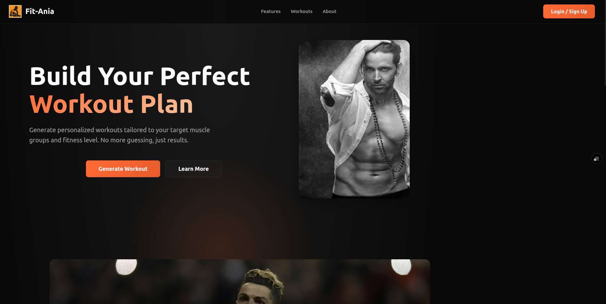
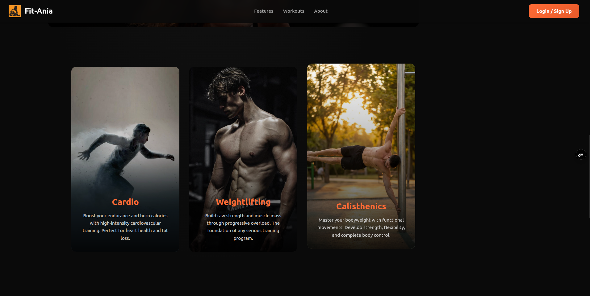
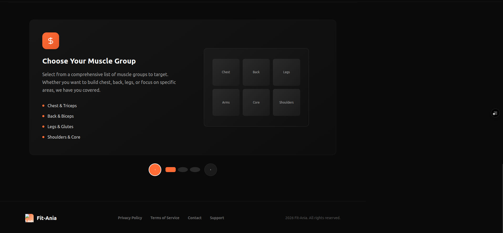
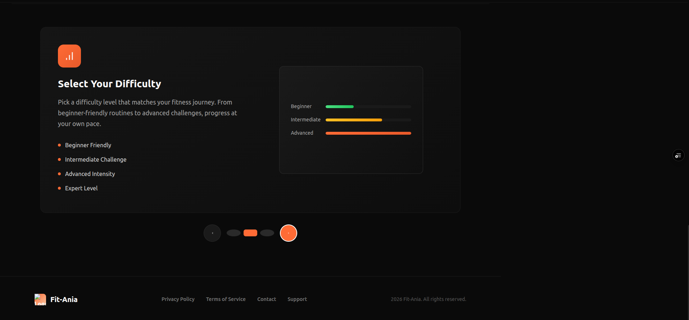
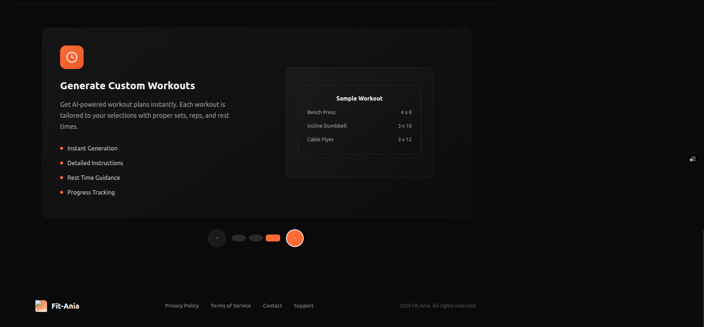

# FitAnia 🏋️‍♂️

FitAnia is a full-stack fitness web application that generates customized workouts based on selected muscle groups and difficulty levels.
Users can create accounts, generate workouts, track their workout history, and view statistics about their training.

The application integrates with an external exercise API and stores user data securely using MongoDB.

---

## 🌐 Live Demo

Frontend: https://fitania.vercel.app
Backend API: https://fitania.onrender.com

---

## 🚀 Features

* 🔐 User authentication using JWT
* 🏋️ Generate workouts by muscle group and difficulty
* 📊 Track workout history
* 📈 View workout statistics
* 👤 User profile dashboard
* ⚡ Guest workout generation (no login required)
* 📱 Responsive UI

---

## 🛠 Tech Stack

### Frontend

* React
* Vite
* React Router
* CSS

### Backend

* Node.js
* Express.js
* MongoDB Atlas
* Mongoose
* JWT Authentication

### APIs

* ExerciseDB (RapidAPI)

### Deployment

* Vercel (Frontend)
* Render (Backend)

---

## 📂 Project Structure

Fit-Ania
├── frontend
│   ├── src
│   ├── public
│   └── package.json
│
├── backend
│   ├── controllers
│   ├── models
│   ├── routes
│   ├── middleware
│   ├── database
│   └── server.js
│
└── README.md

---

## ⚙️ Environment Variables

### Backend (.env)

```
PORT=5000
MONGO_URI=your_mongodb_connection_string
JWT_SECRET=your_secret_key
EXERCISE_DB_KEY=your_rapidapi_key
EXERCISE_DB_HOST=exercisedb.p.rapidapi.com
FRONTEND_PROD=https://your-vercel-app.vercel.app
```

### Frontend (.env)

```
VITE_API_URL=https://your-backend.onrender.com
```

---

## 📦 Installation

### Clone the repository

```
git clone https://github.com/Aymanahmed-23/Fit-Ania.git
cd Fit-Ania
```

---

### Install Backend

```
cd backend
npm install
npm run dev
```

---

### Install Frontend

```
cd frontend
npm install
npm run dev
```

---

## 🧪 Running Locally

Frontend runs on:

```
http://localhost:5173
```

Backend runs on:

```
http://localhost:5000
```

---

## 🔑 Authentication

FitAnia uses JWT tokens for authentication.
After login, the token is stored in the browser and sent with protected API requests.

---

## 📊 Example API Endpoints

Generate workout

```
POST /api/workouts/generate
```

Get workout history

```
GET /api/workouts/history
```

Get workout stats

```
GET /api/workouts/stats
```

User login

```
POST /api/auth/sign-in
```

User registration

```
POST /api/auth/sign-up
```

---

## 📸 Screenshots
### Home Page




<p align="center">
  
  
  
</p>
---

## 👨‍💻 Author

Ayman Ahmed

GitHub: https://github.com/Aymanahmed-23

---


